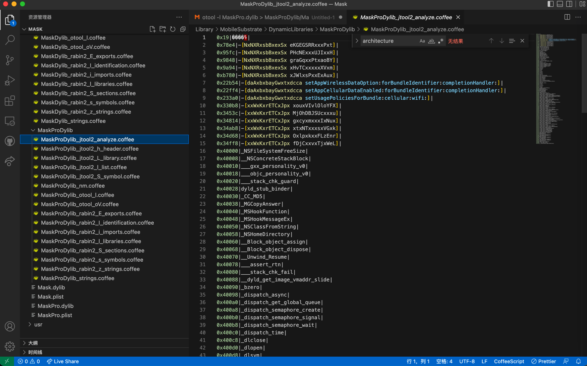

# jtool2用法举例：MaskPro.dylib

## `-h`

```bash
➜  DynamicLibraries export ARCH=arm64
➜  DynamicLibraries jtool2 -h MaskPro.dylib > MaskProDylib/MaskProDylib_jtool2_h_header.txt
```

输出：

```bash
Magic:    64-bit MachO (Little Endian)
Type:    dylib
CPU:    ARM64 (ARMv8)
Cmds:    24
Size:    3304
Flags:    0x100085
```

## `-l`

```bash
➜  DynamicLibraries jtool2 -l MaskPro.dylib > MaskProDylib/MaskProDylib_jtool2_l_list.txt
```

输出：

```bash
LC 00: LC_SEGMENT_64              Mem: 0x000000000-0x40000    __TEXT
    Mem: 0x0000078e4-0x00003e3e0        __TEXT.__text    (Normal)
    Mem: 0x00003e3e0-0x00003e5e4        __TEXT.__stubs    (Symbol Stubs)
    Mem: 0x00003e5e4-0x00003e800        __TEXT.__stub_helper    (Normal)
    Mem: 0x00003e800-0x00003f2c0        __TEXT.__const    
    Mem: 0x00003f2c0-0x00003fb08        __TEXT.__objc_methname    (C-String Literals)
    Mem: 0x00003fb08-0x00003fb3e        __TEXT.__cstring    (C-String Literals)
    Mem: 0x00003fb3e-0x00003fb8d        __TEXT.__objc_classname    (C-String Literals)
    Mem: 0x00003fb8d-0x00003fc0a        __TEXT.__objc_methtype    (C-String Literals)
    Mem: 0x00003fc0c-0x00003fee4        __TEXT.__gcc_except_tab    
    Mem: 0x00003fee4-0x00003fff4        __TEXT.__unwind_info    
LC 01: LC_SEGMENT_64              Mem: 0x000040000-0x48000    __DATA
    Mem: 0x000040000-0x000040030        __DATA.__got    (Non-Lazy Symbol Ptrs)
    Mem: 0x000040030-0x000040188        __DATA.__la_symbol_ptr    (Lazy Symbol Ptrs)
    Mem: 0x000040188-0x000040190        __DATA.__mod_init_func    (Module Init Function Ptrs)
    Mem: 0x000040190-0x000040290        __DATA.__const    
    Mem: 0x000040290-0x0000402b0        __DATA.__cfstring    
    Mem: 0x0000402b0-0x0000402d8        __DATA.__objc_classlist    (Normal)
    Mem: 0x0000402d8-0x0000402e0        __DATA.__objc_imageinfo    
    Mem: 0x0000402e0-0x0000408b0        __DATA.__objc_const    
    Mem: 0x0000408b0-0x000040b90        __DATA.__objc_selrefs    (Literal Pointers)
    Mem: 0x000040b90-0x000040c60        __DATA.__objc_classrefs    (Normal)
    Mem: 0x000040c60-0x000040df0        __DATA.__objc_data    
    Mem: 0x000040df0-0x000044ea8        __DATA.__data    
    Mem: 0x000044ea8-0x000044fb4        __DATA.__bss    (Zero Fill)
    Mem: 0x000044fb4-0x000045170        __DATA.__common    (Zero Fill)
LC 02: LC_SEGMENT_64              Mem: 0x000048000-0x4c000    __LLVM
    Mem: 0x000048000-0x000048001        __LLVM.__bundle    
LC 03: LC_SEGMENT_64              Mem: 0x00004c000-0x50000    __LINKEDIT
LC 04: LC_ID_DYLIB               /Library/MobileSubstrate/DynamicLibraries/MaskPro.dylib
LC 05: LC_DYLD_INFO              
       Rebase info: 184   bytes at offset 311296 (0x4c000-0x4c0b8)
       Bind info:   1208  bytes at offset 311480 (0x4c0b8-0x4c570)
    No Weak info
       Lazy info:   944   bytes at offset 312688 (0x4c570-0x4c920)
       Export info: 1568  bytes at offset 313632 (0x4c920-0x4cf40)
LC 06: LC_SYMTAB                 
LC 07: LC_DYSYMTAB               
        1 local symbols at index     0
      121 external symbols at index  1
       75 undefined symbols at index 122
       No TOC
       No modtab
       92 Indirect symbols at offset 0x4dc10
LC 08: LC_UUID                   UUID: AEBF7878-1DF0-373D-89C5-6B4DA33631D1
LC 09: LC_VERSION_MIN_IPHONEOS    Minimum iOS version:    8.0.0
LC 10: LC_SOURCE_VERSION         Source Version:          0.0.0.0.0
LC 11: LC_ENCRYPTION_INFO_64     Encryption: 0 from offset 16384 spanning 245760 bytes
LC 12: LC_LOAD_DYLIB             /System/Library/Frameworks/AdSupport.framework/AdSupport
LC 13: LC_LOAD_DYLIB             /usr/lib/libMobileGestalt.dylib
LC 14: LC_LOAD_DYLIB             /System/Library/Frameworks/UIKit.framework/UIKit
LC 15: LC_LOAD_DYLIB             /System/Library/Frameworks/Foundation.framework/Foundation
LC 16: LC_LOAD_DYLIB             /Library/Frameworks/CydiaSubstrate.framework/CydiaSubstrate
LC 17: LC_LOAD_DYLIB             /usr/lib/libobjc.A.dylib
LC 18: LC_LOAD_DYLIB             /usr/lib/libc++.1.dylib
LC 19: LC_LOAD_DYLIB             /usr/lib/libSystem.B.dylib
LC 20: LC_LOAD_DYLIB             /System/Library/Frameworks/CoreFoundation.framework/CoreFoundation
LC 21: LC_FUNCTION_STARTS        Offset:    315200, Size:    128 (0x4cf40-0x4cfc0)
LC 22: LC_DATA_IN_CODE           Offset:    315328, Size:      0 (0x4cfc0-0x4cfc0)
LC 23: LC_CODE_SIGNATURE         Offset:    321424, Size:   4528 (0x4e790-0x4f940)
```

## `-L`

```bash
➜  DynamicLibraries jtool2 -L MaskPro.dylib > MaskProDylib/MaskProDylib_jtool2_L_library.txt
```

输出：

```bash
MaskPro.dylib:
    /System/Library/Frameworks/AdSupport.framework/AdSupport (compatibility version 1.0.0, current version 1.0.0)
    /usr/lib/libMobileGestalt.dylib (compatibility version 1.0.0, current version 1.0.0)
    /System/Library/Frameworks/UIKit.framework/UIKit (compatibility version 1.0.0, current version 61000.0.0)
    /System/Library/Frameworks/Foundation.framework/Foundation (compatibility version 300.0.0, current version 1677.104.0)
    /Library/Frameworks/CydiaSubstrate.framework/CydiaSubstrate (compatibility version 0.0.0, current version 0.0.0)
    /usr/lib/libobjc.A.dylib (compatibility version 1.0.0, current version 228.0.0)
    /usr/lib/libc++.1.dylib (compatibility version 1.0.0, current version 902.0.0)
    /usr/lib/libSystem.B.dylib (compatibility version 1.0.0, current version 1281.100.1)
    /System/Library/Frameworks/CoreFoundation.framework/CoreFoundation (compatibility version 150.0.0, current version 1677.104.0)
```

## `-S`

```bash
➜  DynamicLibraries jtool2 -S MaskPro.dylib > MaskProDylib/MaskProDylib_jtool2_S_symbol.txt
```

输出：

```bash
0000000000040d28 D _OBJC_CLASS_$_NbGzxsksqtAxgN
0000000000040c88 D _OBJC_CLASS_$_NxNXRxsbBxexSx
0000000000040cd8 D _OBJC_CLASS_$_daAxbxbayGwxtxdcca
0000000000040d78 D _OBJC_CLASS_$_xrxleWZnuCXPEx
0000000000040dc8 D _OBJC_CLASS_$_xxWxKxrETCxJpx
0000000000040d00 D _OBJC_METACLASS_$_NbGzxsksqtAxgN
0000000000040c60 D _OBJC_METACLASS_$_NxNXRxsbBxexSx
0000000000040cb0 D _OBJC_METACLASS_$_daAxbxbayGwxtxdcca
0000000000040d50 D _OBJC_METACLASS_$_xrxleWZnuCXPEx
0000000000040da0 D _OBJC_METACLASS_$_xxWxKxrETCxJpx
0000000000044fb4 S _g_slide
00000000000450f8 S _x
00000000000450fc S _x.146
。。。
0000000000044fdc S _y.382
                 U _CC_MD5
                 U _MGCopyAnswer
                 U _MSHookFunction
                 U _MSHookMessageEx
                 U _NSClassFromString
                 U _NSFileSystemFreeSize
                 U _NSHomeDirectory
                 U _OBJC_CLASS_$_ASIdentifierManager
                 U _OBJC_CLASS_$_NSBundle
                 U _OBJC_CLASS_$_NSData
                 U _OBJC_CLASS_$_NSDate
                 U _OBJC_CLASS_$_NSDateFormatter
                 U _OBJC_CLASS_$_NSDictionary
                 U _OBJC_CLASS_$_NSFileManager
                 U _OBJC_CLASS_$_NSJSONSerialization
                 U _OBJC_CLASS_$_NSMutableData
                 U _OBJC_CLASS_$_NSMutableDictionary
                 U _OBJC_CLASS_$_NSMutableString
                 U _OBJC_CLASS_$_NSMutableURLRequest
                 U _OBJC_CLASS_$_NSNumber
                 U _OBJC_CLASS_$_NSObject
                 U _OBJC_CLASS_$_NSString
                 U _OBJC_CLASS_$_NSTimeZone
                 U _OBJC_CLASS_$_NSURL
                 U _OBJC_CLASS_$_NSURLConnection
                 U _OBJC_CLASS_$_NSURLRequest
                 U _OBJC_CLASS_$_NSURLSession
                 U _OBJC_CLASS_$_NSURLSessionConfiguration
                 U _OBJC_CLASS_$_UIDevice
                 U _OBJC_METACLASS_$_NSObject
                 U __Block_object_assign
                 U __Block_object_dispose
                 U __NSConcreteGlobalBlock
                 U __NSConcreteStackBlock
                 U __Unwind_Resume
                 U ___CFConstantStringClassReference
                 U ___assert_rtn
                 U ___gxx_personality_v0
                 U ___objc_personality_v0
                 U ___stack_chk_fail
                 U ___stack_chk_guard
                 U __dyld_get_image_vmaddr_slide
                 U __objc_empty_cache
                 U _bzero
                 U _dispatch_async
                 U _dispatch_get_global_queue
                 U _dispatch_semaphore_create
                 U _dispatch_semaphore_signal
                 U _dispatch_semaphore_wait
                 U _dispatch_time
                 U _dlclose
                 U _dlopen
                 U _dlsym
                 U _exit
                 U _free
                 U _getpid
                 U _ioctl
                 U _isatty
                 U _malloc
                 U _objc_autorelease
                 U _objc_autoreleaseReturnValue
                 U _objc_getClass
                 U _objc_msgSend
                 U _objc_release
                 U _objc_retain
                 U _objc_retainAutorelease
                 U _objc_retainAutoreleasedReturnValue
                 U _perror
                 U _pthread_create
                 U _sleep
                 U _strstr
                 U _syscall
                 U _sysctl
                 U _uname
                 U dyld_stub_binder
```

## `--analyze`

```bash
➜  DynamicLibraries jtool2 --analyze MaskPro.dylib > MaskProDylib/MaskProDylib_jtool2_analyze.txt
Analyzing file...
processLoadCommands: Not a Mach-O magic (0xbebafeca)
Resolving stubs..
Not ARM64 - will not resolve stubs..
Processing __DATA..
opened companion file ./MaskPro.dylib.ARM64.AEBF7878-1DF0-373D-89C5-6B4DA33631D1
Dumping symbol cache to file
Symbolicated 131 symbols and 0 functions
➜  DynamicLibraries mv MaskPro.dylib.ARM64.AEBF7878-1DF0-373D-89C5-6B4DA33631D1 MaskProDylib/MaskProDylib_jtool2_analyze.txt
```

输出：


