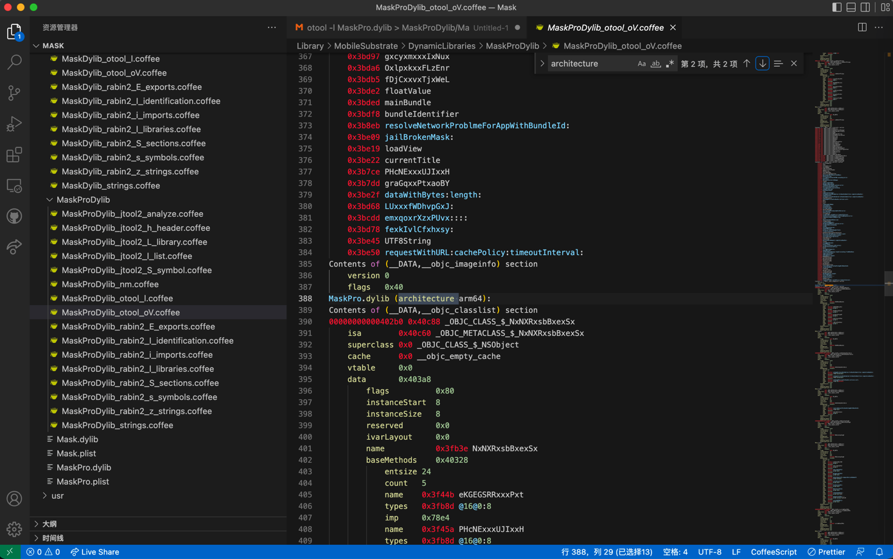

# otool用法举例：MaskPro.dylib

## `-l`

```bash
➜  DynamicLibraries otool -l MaskPro.dylib > MaskProDylib/MaskProDylib_otool_l.txt
```

输出：


## `-oV`

```bash
➜  DynamicLibraries otool -oV MaskPro.dylib > MaskProDylib/MaskProDylib_otool_oV.txt
```

输出：


